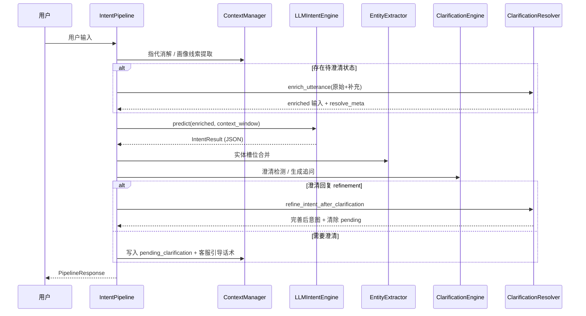
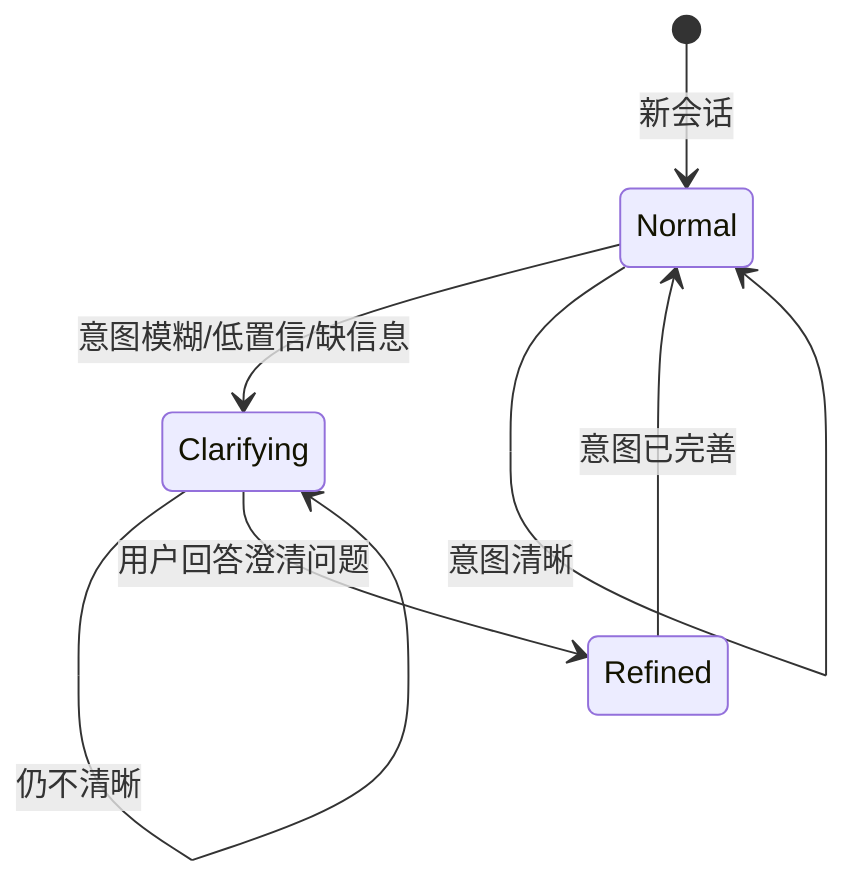

# 多轮对话意图捕捉系统 — 架构与技术文档

> 版本：2.0 · 场景：保险智能营销与客服 · 更新：2026

---

## 1. 背景与目标

### 1.1 业务挑战

保险智能客服场景下，多轮对话意图识别面临三类核心难题：

| 难题 | 示例 | 系统应对 |
|------|------|----------|
| **上下文依赖** | 「那它的等待期是多久？」需知道「它」指哪款产品 | 指代消解 + 槽位跨轮继承 |
| **意图漂移** | 从「重疾险保费」转到「医疗险理赔流程」 | 漂移检测 + 主题栈 |
| **隐式/模糊意图** | 「我最近经常出差」隐含意外险需求；「了解一下」过于模糊 | 隐式挖掘 + 澄清引导闭环 |

### 1.2 设计目标

- 不依赖固定意图枚举，由 **大模型动态捕获** 用户真实诉求
- 以 **保险行业 12 类常见意图** 为参考框架，兼顾灵活性与可运营性
- 意图不清晰时 **主动澄清**，用户回复后 **refinement** 完善识别结果
- 支持同步 CLI、异步 API 两种部署形态

---

## 2. 整体架构

### 2.1 逻辑架构（三层）

```
┌─────────────────────────────────────────────────────────────────┐
│                        接入层 (Entry)                            │
│   chat.py (交互 CLI)  │  main.py (演示)  │  api/server.py (API) │
└───────────────────────────────┬─────────────────────────────────┘
                                │
┌───────────────────────────────▼─────────────────────────────────┐
│                     编排层 (IntentPipeline)                        │
│  上下文管理 → LLM 动态分析 → 实体合并 → 漂移检测 → 澄清/refinement  │
└───────────────────────────────┬─────────────────────────────────┘
                                │
        ┌───────────────────────┼───────────────────────┐
        ▼                       ▼                       ▼
┌───────────────┐     ┌─────────────────┐     ┌─────────────────┐
│  理解层        │     │  决策层          │     │  领域层          │
│ ContextManager│     │ Clarification   │     │ insurance_domain│
│ EntityExtract │     │ DriftDetector   │     │ (12类参考框架)   │
│ LLMIntentEng  │     │ ClarifyResolver │     │ PRODUCT_ENTITIES│
└───────────────┘     └─────────────────┘     └─────────────────┘
                                │
┌───────────────────────────────▼─────────────────────────────────┐
│                     基础设施层 (Infrastructure)                    │
│        DeepSeek API  │  Session Store (内存)  │  config/settings   │
└─────────────────────────────────────────────────────────────────┘
```

### 2.2 数据流（单轮处理）



### 2.3 澄清闭环



---

## 3. 技术路线

### 3.1 核心选型

| 层次 | 技术选型 | 选型理由 |
|------|----------|----------|
| 意图理解 | **DeepSeek API** (OpenAI 兼容) | Chain-of-Intent 结构化 JSON 输出；成本低、中文能力强 |
| 数据校验 | **Pydantic v2** | 意图/槽位/澄清模型类型安全 |
| HTTP 客户端 | **httpx** | 同步/异步 LLM 调用 |
| API 服务 | **FastAPI** | 异步 predict、OpenAPI 文档 |
| 配置管理 | **python-dotenv** | 环境变量隔离密钥 |

### 3.2 意图识别范式：参考框架 + 动态捕获

**不采用**传统「固定意图枚举 + 分类器」方案，**采用**：

```
保险 12 类参考框架 ──prompt 注入──▶ DeepSeek
                                      │
用户输入 + 多轮上下文 ──────────────▶│ Chain-of-Intent 推理
                                      │
                                      ▼
                            intent_label (自然语言描述)
                            category     (参考分类 code)
                            slots / sub_intents / implicit_intents
                            clarification (澄清引导)
```

**参考分类（12 类）**：

| code | 名称 | 典型场景 |
|------|------|----------|
| `product_inquiry` | 产品咨询 | 保障范围、条款、适购人群 |
| `premium_inquiry` | 保费询价 | 多少钱、费率、缴费方式 |
| `coverage_terms` | 保障条款 | 等待期、免责、续保 |
| `claims_service` | 理赔服务 | 流程、材料、进度 |
| `purchase` | 投保购买 | 购买意向、投保流程 |
| `product_compare` | 产品对比 | 多款产品差异 |
| `policy_service` | 保单服务 | 续保、退保、变更 |
| `value_added` | 权益增值 | 绿通、体检 |
| `product_recommend` | 产品推荐 | 含隐式需求推荐 |
| `complaint_feedback` | 投诉建议 | 投诉与反馈 |
| `greeting_chitchat` | 寒暄闲聊 | 问候 |
| `other` | 其他 | 无法归类 |

`intent_label` 由 LLM **自由生成**（如「查询安心保重疾险 2026 的等待期」），`category` 映射到上述参考分类，便于下游路由与统计。

### 3.3 LLM Prompt 策略（Chain-of-Intent）

System Prompt 包含：

1. 保险参考分类框架（`build_category_prompt()`）
2. 六大原则：动态捕获、参考分类、多轮理解、隐式挖掘、多意图并存、**意图澄清**
3. 澄清回复 **refinement** 规则：上下文含「澄清进行中」时，合并原始输入与用户补充，输出高置信意图
4. 严格 JSON 输出（`response_format: json_object`）

输出 schema 核心字段：

```json
{
  "primary_intent": { "intent_label", "category", "confidence" },
  "sub_intents": [...],
  "implicit_intents": [...],
  "slots": {...},
  "missing_info": [...],
  "drift_detected": false,
  "clarification": {
    "needs_clarification": true,
    "clarification_questions": [{ "question_id", "question", "purpose", "fills_slot" }],
    "guide_response": "...",
    "options": [...]
  }
}
```

### 3.4 降级策略

| 条件 | 行为 |
|------|------|
| 未配置 `DEEPSEEK_API_KEY` | `EntityExtractor.infer_intent_hint()` 规则降级 |
| LLM 调用失败 | 同上，记录 warning 日志 |
| LLM 不可用时的澄清 | `ClarificationEngine` 规则模板生成追问 |

---

## 4. 模块设计与实现思路

### 4.1 主管道 `IntentPipeline`

**职责**：串联各模块，维护会话状态，输出统一 `PipelineResponse`。

**处理步骤**：

1. **预处理**：指代消解（`ContextManager.resolve_references`）、用户画像线索
2. **澄清上下文注入**：若 `pending_clarification.active`，拼接澄清块 + enrich 输入
3. **LLM 分析**：`LLMIntentEngine.predict` / `predict_async`
4. **后处理**：实体槽位合并 → 漂移检测 → 澄清评估
5. **澄清分支**：
   - 澄清回复 → `ClarificationResolver.refine_intent_after_clarification`
   - 需澄清 → 写入 `pending_clarification`，追加客服引导到对话历史
6. **状态更新**：turn 记录、active_product、topic_stack

### 4.2 上下文管理 `ContextManager`（DST SOTA）

| 能力 | 实现 |
|------|------|
| **TopicFrame** | 主题帧栈，追踪活跃/历史主题 |
| **分层上下文窗口** | DST 快照 + 近期对话 + 澄清状态 |
| **多层指代消解** | 代词 / 指示词 / 省略句（「等待期呢？」） |
| **entity_salience** | 实体显著性，辅助焦点产品解析 |
| **category_history** | 分类轨迹，支持回到先前话题判定 |
| **dialogue_phase** | 对话阶段（greeting/inquiry/service/transaction） |
| **槽位冲突消解** | 跨轮继承 + 近轮冲突保留 |

### 4.3 LLM 意图引擎 `LLMIntentEngine`

- 调用 DeepSeek `/v1/chat/completions`
- 解析 JSON，校验 `category` 是否在参考框架内（否则归 `other`）
- 将 `clarification` 块透传至 `IntentResult.llm_clarification`

### 4.4 实体抽取 `EntityExtractor`

**定位**：辅助 LLM，不做主意图分类。

- 产品名匹配（`PRODUCT_ENTITIES` 别名表）
- 规则槽位：年龄、保额、缴费年限等正则
- 降级路径：关键词 → 参考分类 hint

### 4.5 澄清引导 `ClarificationEngine`

**触发条件**（满足任一）：

- `confidence < 0.72`
- `category == other`
- 关键槽位缺失（如保费咨询无 product_name）
- 模糊表述（「了解一下」等短句/模式匹配）
- 多意图置信度接近（ambiguous）

**输出**：

- `guide_response`：客服话术（含编号追问列表）
- `clarification_questions`：结构化问题（question_id / purpose / fills_slot）
- `suggested_options`：可选方向

### 4.6 澄清解析 `ClarificationResolver`

**澄清回复处理**：

1. `enrich_utterance`：拼接「原始输入 + 用户补充 + 选项匹配结果」
2. `_resolve_user_answer`：解析序号（「1」）、选项文本、关键词（「重疾险」→ product_inquiry）
3. `refine_intent_after_clarification`：提升置信度、合并 intent_label、写入 refinement 说明
4. 清除 `pending_clarification`

### 4.7 漂移检测 `IntentDriftDetector`（多信号融合 SOTA）

五层融合 + 工业规则增强（对齐 SITS / Rasa CALM / Chain-of-Intent 实践）：

| 信号 | 权重 | 说明 |
|------|------|------|
| category_distance | 0.25 | 分类业务图距离（`category_graph.py`） |
| utterance_semantic_shift | 0.25 | 话语 n-gram 语义偏移 |
| intent_label_shift | 0.15 | 意图描述语义偏移 |
| topic_stack_divergence | 0.10 | 主题栈/分类轨迹偏离 |
| product_focus_change | 0.10 | 焦点产品变更 |
| explicit_marker_boost | 0.10 | 「另外/换个话题」等显式标记 |
| llm_drift_signal | 0.15 | LLM 漂移判定融合 |

**规则增强**：显式换题 + 分类跳变 → 漂移分 ≥ 0.58；LLM 判定 + 分类跳变 → ≥ 0.62

**判定逻辑**：
- 相关分类链内切换 → `SUB_INTENT_SWITCH`，**不算漂移**
- 延续标记（它/呢/等待期呢）+ 低融合分 → **不算漂移**
- 澄清进行中 → **不算漂移**
- 回到先前分类轨迹 → **SUB_INTENT_SWITCH**
- 融合分 ≥ 阈值 → `TOPIC_SHIFT` 或 `CLARIFICATION`

输出可解释信号：`DriftSignals.to_dict()` 写入 `metadata.drift_signals`

---

## 5. 数据模型

### 5.1 核心模型关系

```
SessionContext
├── turns: DialogueTurn[]
├── active_intent_label / active_category / active_product
├── slot_memory: Dict[str, Slot]
├── topic_stack: str[]
└── pending_clarification: PendingClarification
        ├── original_utterance
        ├── tentative_intent_label / tentative_category
        ├── questions: ClarificationQuestion[]
        └── suggested_options: str[]

IntentResult
├── intent_label (动态描述)
├── category (参考分类 code)
├── confidence / reasoning
├── slots / sub_intents / implicit_intents
├── missing_info / drift_*
└── llm_clarification (LLM 原始澄清块)

PipelineResponse
├── intent: IntentResult
├── clarification: ClarificationGuide
├── should_clarify / missing_slots
└── metadata (category_name, clarification_resolved, ...)
```

### 5.2 会话状态（内存）

当前实现使用 `IntentPipeline._sessions: Dict[str, SessionContext]` 内存存储。生产环境可替换为 Redis / DB，接口层 `session_id` 已预留。

---

## 6. 部署架构

### 6.1 开发/演示

```
开发者 → python chat.py → IntentPipeline → DeepSeek API
```

### 6.2 生产 API

```
客户端 → FastAPI (uvicorn)
           ├── POST /v1/intent/predict       (async + LLM)
           ├── POST /v1/intent/predict/sync  (sync)
           ├── GET  /v1/intent/categories    (参考分类)
           ├── DELETE /v1/session/{id}      (重置会话)
           └── GET  /health
```

### 6.3 推荐生产扩展

| 组件 | 建议 |
|------|------|
| 会话存储 | Redis（TTL + session_id） |
| LLM 网关 | 限流、重试、熔断、多模型 fallback |
| 观测 | 意图分布、澄清率、refinement 成功率、P99 延迟 |
| 评测 | 标注集 + 定期跑 `tests/run_tests.py` + LLM 评测集 |

---

## 7. 关键流程示例

### 7.1 指代消解 + 动态意图

```
Turn 1  用户: 安心保重疾险2026年保费多少？
        → intent_label: 查询安心保重疾险2026的保费
        → category: premium_inquiry
        → slots: { product_name: 安心保重疾险2026 }

Turn 2  用户: 那它的等待期是多久？
        → 消解: 那安心保重疾险2026的等待期是多久？
        → intent_label: 查询安心保重疾险2026的等待期
        → category: coverage_terms
```

### 7.2 澄清 → refinement

```
Turn 1  用户: 了解一下
        → needs_clarification: true
        → 澄清问题: 您想了解哪类保险？/ 有具体产品名吗？
        → pending_clarification.active = true

Turn 2  用户: 重疾险
        → enriched: [澄清上下文] 最初「了解一下」+ 补充「重疾险」
        → refinement: 了解重疾险产品保障
        → clarification_resolved: true
        → pending_clarification.active = false
```

---

## 8. 质量保障

### 8.1 自动化测试

`tests/run_tests.py` 覆盖 27 项：

- 实体抽取、指代消解、动态分类
- 澄清触发、结构化问题、澄清 refinement 闭环
- 多轮流程、API 接口

### 8.2 指标与阈值（config/settings.py）

```python
QualityThresholds:
  intent_accuracy              = 0.95
  drift_detection_rate         = 0.92
  multi_intent_accuracy        = 0.88
  clarification_confidence_threshold = 0.72

LatencyBudget:
  total_ms = 600  # 轻量路径；LLM 路径实际 1–3s
```

---

## 9. 演进路线

| 阶段 | 内容 | 状态 |
|------|------|------|
| P0 | LLM 动态意图 + 参考框架 + DeepSeek | ✅ 已完成 |
| P0 | 澄清引导 + refinement 闭环 | ✅ 已完成 |
| P1 | Redis 会话持久化 | 待实现 |
| P1 | 意图识别评测集与准确率报表 | 待实现 |
| P2 | 轻量模型本地预过滤（降 LLM 调用量） | 待实现 |
| P2 | 与业务编排/Rasa CALM 对接 | 待实现 |

---

## 10. 附录：目录与职责速查

| 路径 | 职责 |
|------|------|
| `src/pipeline.py` | 主管道编排 |
| `src/engines/llm_engine.py` | DeepSeek Chain-of-Intent |
| `src/engines/entity_extractor.py` | 实体抽取与规则降级 |
| `src/context/manager.py` | 上下文、指代消解、槽位记忆 |
| `src/clarification/guidance.py` | 澄清检测与问题生成 |
| `src/clarification/resolver.py` | 澄清回复解析与 refinement |
| `src/drift/detector.py` | 意图漂移检测 |
| `src/domain/insurance_domain.py` | 12 类参考框架与产品库 |
| `src/models/intent.py` | 意图/会话/槽位模型 |
| `src/models/clarification.py` | 澄清相关模型 |
| `api/server.py` | FastAPI 生产接口 |
| `chat.py` | 交互式 CLI |
