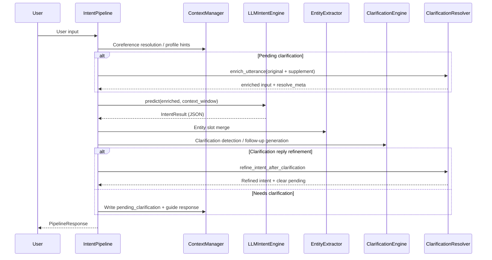
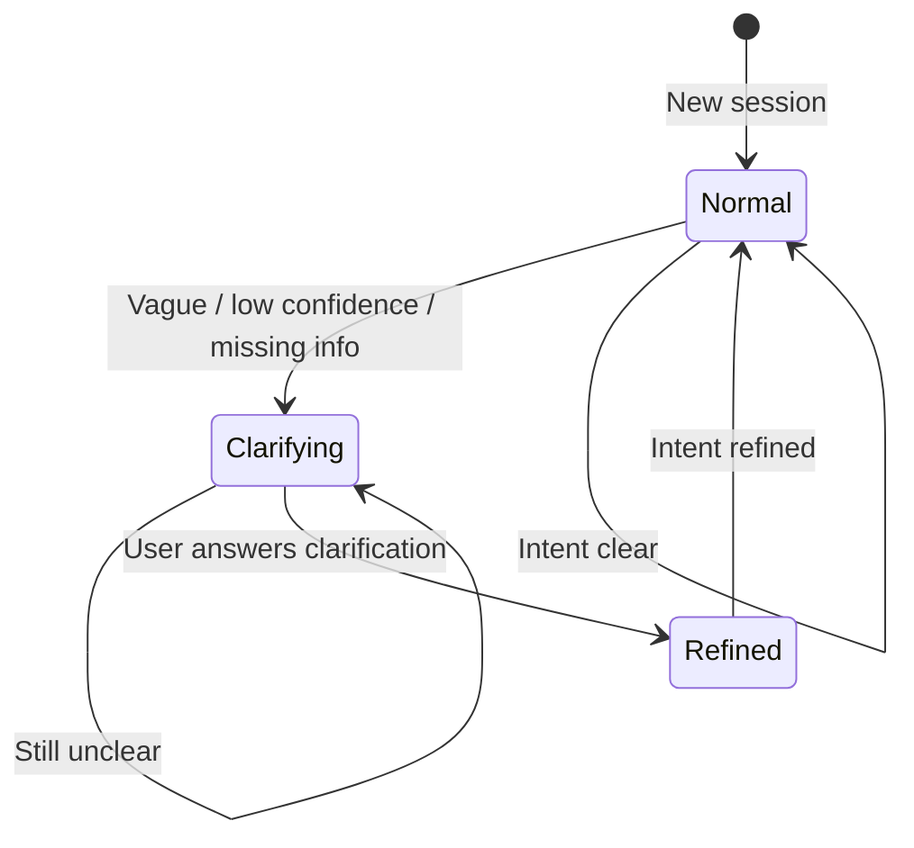

# Multi-Turn Dialogue Intent Recognition — Architecture & Technical Documentation

> Version: 2.0 · Domain: Insurance smart marketing & customer service · Updated: 2026

---

## 1. Background & Goals

### 1.1 Business Challenges

In insurance smart customer service, multi-turn intent recognition faces three core challenges:

| Challenge | Example | System Response |
|-----------|---------|-----------------|
| **Context dependency** | "How long is its waiting period?" requires knowing which product "it" refers to | Coreference resolution + cross-turn slot inheritance |
| **Intent drift** | Switching from "critical illness premium" to "medical claims process" | Drift detection + topic stack |
| **Implicit / vague intent** | "I travel a lot lately" implies accident insurance need; "tell me more" is too vague | Implicit intent mining + clarification loop |

### 1.2 Design Goals

- Do not rely on fixed intent enums — use **LLM dynamic capture** of user intent
- Use **12 common insurance intent categories** as a reference framework for flexibility and operability
- **Proactively clarify** when intent is unclear; **refine** recognition after user replies
- Support both sync CLI and async API deployment modes

---

## 2. Overall Architecture

### 2.1 Logical Architecture (Three Layers)

```
┌─────────────────────────────────────────────────────────────────┐
│                        Entry Layer                               │
│   chat.py (CLI)  │  main.py (demo)  │  api/server.py (API)      │
└───────────────────────────────┬─────────────────────────────────┘
                                │
┌───────────────────────────────▼─────────────────────────────────┐
│                     Orchestration (IntentPipeline)               │
│  Context → LLM analysis → Entity merge → Drift → Clarify/refine  │
└───────────────────────────────┬─────────────────────────────────┘
                                │
        ┌───────────────────────┼───────────────────────┐
        ▼                       ▼                       ▼
┌───────────────┐     ┌─────────────────┐     ┌─────────────────┐
│  Understanding│     │  Decision       │     │  Domain         │
│ ContextManager│     │ Clarification   │     │ insurance_domain│
│ EntityExtract │     │ DriftDetector   │     │ (12 categories) │
│ LLMIntentEng  │     │ ClarifyResolver │     │ PRODUCT_ENTITIES│
└───────────────┘     └─────────────────┘     └─────────────────┘
                                │
┌───────────────────────────────▼─────────────────────────────────┐
│                     Infrastructure                               │
│   DeepSeek / Qwen API  │  Session Store (in-memory)  │  config  │
└─────────────────────────────────────────────────────────────────┘
```

### 2.2 Data Flow (Single Turn)



### 2.3 Clarification Loop



---

## 3. Technical Approach

### 3.1 Core Technology Choices

| Layer | Choice | Rationale |
|-------|--------|-----------|
| Intent understanding | **DeepSeek / Qwen API** (OpenAI-compatible) | Chain-of-Intent structured JSON output; cost-effective, strong Chinese |
| Data validation | **Pydantic v2** | Type-safe intent/slot/clarification models |
| HTTP client | **httpx** | Sync/async LLM calls |
| API service | **FastAPI** | Async predict, OpenAPI docs |
| Configuration | **python-dotenv** | Environment-based secret isolation |

### 3.2 Intent Paradigm: Reference Framework + Dynamic Capture

**Not using** traditional "fixed intent enum + classifier". **Using**:

```
Insurance 12-category reference ──prompt inject──▶ LLM
                                                    │
User input + multi-turn context ──────────────────▶│ Chain-of-Intent reasoning
                                                    │
                                                    ▼
                              intent_label (natural language description)
                              category     (reference category code)
                              slots / sub_intents / implicit_intents
                              clarification (clarification guidance)
```

**Reference categories (12)**:

| code | Name | Typical scenarios |
|------|------|-------------------|
| `product_inquiry` | Product inquiry | Coverage, terms, target audience |
| `premium_inquiry` | Premium quote | Price, rate, payment method |
| `coverage_terms` | Coverage terms | Waiting period, exclusions, renewal |
| `claims_service` | Claims service | Process, documents, status |
| `purchase` | Purchase | Purchase intent, enrollment flow |
| `product_compare` | Product comparison | Differences across products |
| `policy_service` | Policy service | Renewal, surrender, changes |
| `value_added` | Value-added benefits | Green channel, health checkups |
| `product_recommend` | Product recommendation | Including implicit need recommendations |
| `complaint_feedback` | Complaints & feedback | Complaints and feedback |
| `greeting_chitchat` | Greeting / chitchat | Greetings |
| `other` | Other | Unclassifiable |

`intent_label` is **freely generated** by the LLM (e.g. "Query waiting period for Anxin Critical Illness 2026"); `category` maps to the reference taxonomy for downstream routing and analytics.

### 3.3 LLM Prompt Strategy (Chain-of-Intent)

System prompt includes:

1. Insurance reference category framework (`build_category_prompt()`)
2. Six principles: dynamic capture, reference categories, multi-turn understanding, implicit mining, multi-intent coexistence, **intent clarification**
3. Clarification reply **refinement** rules: when context shows "clarification in progress", merge original input with user supplement for high-confidence intent
4. Strict JSON output (`response_format: json_object`)

Core output schema fields:

```json
{
  "primary_intent": { "intent_label", "category", "confidence" },
  "sub_intents": [...],
  "implicit_intents": [...],
  "slots": {...},
  "missing_info": [...],
  "drift_detected": false,
  "clarification": {
    "needs_clarification": true,
    "clarification_questions": [{ "question_id", "question", "purpose", "fills_slot" }],
    "guide_response": "...",
    "options": [...]
  }
}
```

### 3.4 Fallback Strategy

| Condition | Behavior |
|-----------|----------|
| LLM API key not configured | `EntityExtractor.infer_intent_hint()` rule-based fallback |
| LLM call failure | Same fallback, warning logged |
| Clarification without LLM | `ClarificationEngine` rule-based follow-up templates |

---

## 4. Module Design & Implementation

### 4.1 Main Pipeline `IntentPipeline`

**Responsibility**: Orchestrate modules, maintain session state, output unified `PipelineResponse`.

**Processing steps**:

1. **Preprocess**: Coreference resolution (`ContextManager.resolve_references`), user profile hints
2. **Clarification context injection**: If `pending_clarification.active`, append clarification block + enrich input
3. **LLM analysis**: `LLMIntentEngine.predict` / `predict_async`
4. **Postprocess**: Entity slot merge → drift detection → clarification evaluation
5. **Clarification branch**:
   - Clarification reply → `ClarificationResolver.refine_intent_after_clarification`
   - Needs clarification → write `pending_clarification`, append guide response to dialogue history
6. **State update**: turn record, active_product, topic_stack

### 4.2 Context Management `ContextManager` (DST)

| Capability | Implementation |
|------------|----------------|
| **TopicFrame** | Topic frame stack, track active/historical topics |
| **Layered context window** | DST snapshot + recent dialogue + clarification state |
| **Multi-layer coreference** | Pronouns / demonstratives / ellipsis ("what about waiting period?") |
| **entity_salience** | Entity salience for focus product resolution |
| **category_history** | Category trajectory for return-to-topic detection |
| **dialogue_phase** | Dialogue phase (greeting/inquiry/service/transaction) |
| **Slot conflict resolution** | Cross-turn inheritance + recent-turn conflict retention |

### 4.3 LLM Intent Engine `LLMIntentEngine`

- Calls OpenAI-compatible `/v1/chat/completions` (DeepSeek or Qwen)
- Parses JSON, validates `category` against reference framework (else `other`)
- Passes `clarification` block through to `IntentResult.llm_clarification`

### 4.4 Entity Extraction `EntityExtractor`

**Role**: Assist LLM; not primary intent classification.

- Product name matching (`PRODUCT_ENTITIES` alias table)
- Rule-based slots: age, sum insured, payment term via regex
- Fallback path: keywords → reference category hint

### 4.5 Clarification Guidance `ClarificationEngine`

**Trigger conditions** (any one):

- `confidence < 0.72`
- `category == other`
- Missing key slots (e.g. premium inquiry without product_name)
- Vague phrasing ("tell me more" and similar short/pattern matches)
- Close multi-intent confidence (ambiguous)

**Output**:

- `guide_response`: Customer service script (with numbered follow-ups)
- `clarification_questions`: Structured questions (question_id / purpose / fills_slot)
- `suggested_options`: Optional directions

### 4.6 Clarification Resolver `ClarificationResolver`

**Clarification reply handling**:

1. `enrich_utterance`: Concatenate "original input + user supplement + option match"
2. `_resolve_user_answer`: Parse index ("1"), option text, keywords ("critical illness" → product_inquiry)
3. `refine_intent_after_clarification`: Boost confidence, merge intent_label, write refinement note
4. Clear `pending_clarification`

### 4.7 Drift Detection `IntentDriftDetector` (Multi-Signal Fusion)

Five-layer fusion + industrial rule enhancements (aligned with SITS / Rasa CALM / Chain-of-Intent practices):

| Signal | Weight | Description |
|--------|--------|-------------|
| category_distance | 0.25 | Category graph distance (`category_graph.py`) |
| utterance_semantic_shift | 0.25 | Utterance n-gram semantic shift |
| intent_label_shift | 0.15 | Intent label semantic shift |
| topic_stack_divergence | 0.10 | Topic stack / category trajectory divergence |
| product_focus_change | 0.10 | Focus product change |
| explicit_marker_boost | 0.10 | Explicit markers ("by the way", "change topic") |
| llm_drift_signal | 0.15 | LLM drift signal fusion |

**Rule enhancements**: explicit topic change + category jump → drift score ≥ 0.58; LLM signal + category jump → ≥ 0.62

**Decision logic**:
- Related category chain switch → `SUB_INTENT_SWITCH`, **not drift**
- Continuation markers (it/what about/waiting period?) + low fusion score → **not drift**
- Clarification in progress → **not drift**
- Return to prior category trajectory → **SUB_INTENT_SWITCH**
- Fusion score ≥ threshold → `TOPIC_SHIFT` or `CLARIFICATION`

Explainable output: `DriftSignals.to_dict()` written to `metadata.drift_signals`

---

## 5. Data Models

### 5.1 Core Model Relationships

```
SessionContext
├── turns: DialogueTurn[]
├── active_intent_label / active_category / active_product
├── slot_memory: Dict[str, Slot]
├── topic_stack: str[]
└── pending_clarification: PendingClarification
        ├── original_utterance
        ├── tentative_intent_label / tentative_category
        ├── questions: ClarificationQuestion[]
        └── suggested_options: str[]

IntentResult
├── intent_label (dynamic description)
├── category (reference category code)
├── confidence / reasoning
├── slots / sub_intents / implicit_intents
├── missing_info / drift_*
└── llm_clarification (raw LLM clarification block)

PipelineResponse
├── intent: IntentResult
├── clarification: ClarificationGuide
├── should_clarify / missing_slots
└── metadata (category_name, clarification_resolved, ...)
```

### 5.2 Session State (In-Memory)

Current implementation uses `IntentPipeline._sessions: Dict[str, SessionContext]` in memory. For production, replace with Redis / DB; `session_id` is already supported at the API layer.

---

## 6. Deployment Architecture

### 6.1 Development / Demo

```
Developer → python chat.py → IntentPipeline → LLM API (DeepSeek / Qwen)
```

### 6.2 Production API

```
Client → FastAPI (uvicorn)
           ├── POST /v1/intent/predict       (async + LLM)
           ├── POST /v1/intent/predict/sync  (sync)
           ├── GET  /v1/intent/categories    (reference categories)
           ├── DELETE /v1/session/{id}      (reset session)
           └── GET  /health
```

### 6.3 Recommended Production Extensions

| Component | Recommendation |
|-----------|----------------|
| Session storage | Redis (TTL + session_id) |
| LLM gateway | Rate limiting, retry, circuit breaker, multi-model fallback |
| Observability | Intent distribution, clarification rate, refinement success, P99 latency |
| Evaluation | Labeled dataset + periodic `tests/run_tests.py` + LLM eval set |

---

## 7. Key Flow Examples

### 7.1 Coreference Resolution + Dynamic Intent

```
Turn 1  User: How much is Anxin Critical Illness 2026 premium?
        → intent_label: Query premium for Anxin Critical Illness 2026
        → category: premium_inquiry
        → slots: { product_name: Anxin Critical Illness 2026 }

Turn 2  User: How long is its waiting period?
        → Resolved: How long is Anxin Critical Illness 2026 waiting period?
        → intent_label: Query waiting period for Anxin Critical Illness 2026
        → category: coverage_terms
```

### 7.2 Clarification → Refinement

```
Turn 1  User: Tell me more
        → needs_clarification: true
        → Questions: Which insurance type? / Any specific product name?
        → pending_clarification.active = true

Turn 2  User: Critical illness
        → enriched: [clarification context] original "tell me more" + supplement "critical illness"
        → refinement: Learn about critical illness product coverage
        → clarification_resolved: true
        → pending_clarification.active = false
```

---

## 8. Quality Assurance

### 8.1 Automated Tests

`tests/run_tests.py` covers 27 cases:

- Entity extraction, coreference resolution, dynamic classification
- Clarification trigger, structured questions, clarification refinement loop
- Multi-turn flow, API endpoints

`tests/test_context_drift.py` covers 23 context & drift cases.

### 8.2 Metrics & Thresholds (`config/settings.py`)

```python
QualityThresholds:
  intent_accuracy              = 0.95
  drift_detection_rate         = 0.92
  multi_intent_accuracy        = 0.88
  clarification_confidence_threshold = 0.72

LatencyBudget:
  total_ms = 600  # lightweight path; LLM path typically 1–3s
```

---

## 9. Roadmap

| Phase | Item | Status |
|-------|------|--------|
| P0 | LLM dynamic intent + reference framework + DeepSeek/Qwen | ✅ Done |
| P0 | Clarification guidance + refinement loop | ✅ Done |
| P1 | Redis session persistence | Planned |
| P1 | Intent eval dataset and accuracy reporting | Planned |
| P2 | Lightweight local pre-filter (reduce LLM calls) | Planned |
| P2 | Integration with business orchestration / Rasa CALM | Planned |

---

## 10. Appendix: Directory Quick Reference

| Path | Responsibility |
|------|----------------|
| `src/pipeline.py` | Main pipeline orchestration |
| `src/engines/llm_engine.py` | LLM Chain-of-Intent engine |
| `src/engines/entity_extractor.py` | Entity extraction and rule fallback |
| `src/context/manager.py` | Context, coreference, slot memory |
| `src/clarification/guidance.py` | Clarification detection and question generation |
| `src/clarification/resolver.py` | Clarification reply parsing and refinement |
| `src/drift/detector.py` | Intent drift detection |
| `src/domain/insurance_domain.py` | 12-category reference framework and product catalog |
| `src/models/intent.py` | Intent / session / slot models |
| `src/models/clarification.py` | Clarification models |
| `api/server.py` | FastAPI production API |
| `chat.py` | Interactive CLI |
